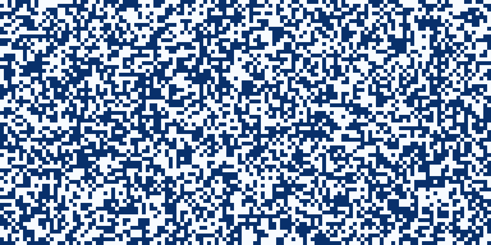

# Conway's Game of Life... with tensors!

## Game of Life

The Game of Life is a zero player game invented by  John Horton Conway in 1970 in which a cell population develop over time following deterministic rules. The user only choose the initial conditions and observe how the population evolve.

It follows a simple set of rules, summarized as:
* Underpopulation: Any live cell with fewer than two live neighbours dies, as if by underpopulation.
* Normal: Any live cell with two or three live neighbours lives on to the next generation.
* Overpopulation: Any live cell with more than three live neighbours dies.
* Reproduction: Any dead cell with exactly three live neighbours becomes a live cell.

## Why using tensors

The behavior of a cell is dictated by its number of neighbors. One elegant way to count the neighbors is to apply a single convolution filter on the game map to count the neighbors.

Moreover,

## To-do

* Implement more seed (Gosper's Glider Gun)
* Store seed in a JSON file? or pickle
